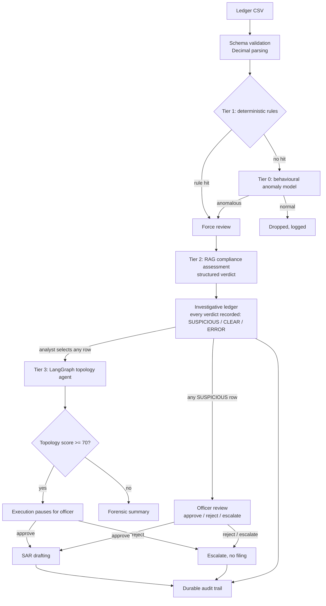

# Fintech Fraud Auditor

A tool that screens bank transactions for money laundering using rules, statistics, network analysis and an AI model, with a compliance officer making the final call.

## What it is

The tool reads a ledger of bank transactions and works out which ones look like money laundering. Quick rules and statistics pick out the suspicious transactions, an AI model reviews those against anti-money-laundering guidance, and a compliance officer must approve before a Suspicious Activity Report (SAR) is drafted. Every decision is recorded in an audit log.

## Why it's harder than it sounds

Banks handle huge numbers of transactions. Having an AI model review every one would be slow and expensive, but filtering too aggressively lets real laundering slip through unseen. Laundering is also designed to look ordinary: a large sum is split into transfers just under the reporting limit, or money is passed around a circle of accounts until its origin is hard to trace. The challenge is narrowing the list down cheaply without throwing away the cases that matter.

## How it works

1. **Rules** flag the obvious cases: names on sanctions lists, high-risk countries, and amounts split to stay just under the reporting limit.
2. **A pattern model** looks at how each account behaves and flags the unusual ones.
3. **An AI model** reviews the flagged transactions against compliance guidance and gives a clear verdict.
4. **A network check** looks for money travelling in a circle through several accounts.
5. **A compliance officer** makes the final decision, and every step is written to an audit log.

## Results

Measured on a synthetic ledger of 465 transactions, 45 of them labelled as laundering:

| Pipeline | Laundering caught (recall) | Flags that were real (precision) | Sent to the AI model |
|---|---|---|---|
| Original order (statistics first) | 7% | 33% | 9 rows |
| Current order (rules first) | 84% | 79% | 48 rows |

By type of laundering:

| Pattern | What it looks like | Caught |
|---|---|---|
| structuring | One large sum split into transfers just under the $10,000 limit | 10 of 10 |
| sanctioned | Transfers involving a high-risk jurisdiction | 6 of 6 |
| fan_in | Many accounts sending money into one account | 11 of 11 |
| circular | Money sent around a loop in large amounts | 3 of 3 |
| circular_small | The same loop in smaller amounts, through new accounts | 7 of 7 |
| circular_camouflaged | The same loop through established businesses | 1 of 8 (known gap) |

The same author wrote both the detector and the test data, so treat these numbers as a regression check rather than a real-world detection rate. The method, the caveats and the reasoning behind each number are in [docs/EVALUATION.md](docs/EVALUATION.md).

## Architecture



- **Tier 1, rules** (`utils/rules.py`): reporting threshold, the structuring band just below it, high-risk jurisdictions, fuzzy sanctions-name matching and unidentified counterparties. A rule hit always forces a review.
- **Tier 0, behaviour model** (`utils/funnel.py`, `utils/features.py`): twelve account-behaviour features scored against the batch's own median.
- **Tier 2, AI review** (`utils/agents.py`): retrieval-grounded analysis with a structured verdict. Runs on Claude Haiku 4.5 (Amazon Bedrock) or Gemini 2.5 Flash (Google Vertex AI), switchable in config.
- **Tier 3, network check** (`utils/graph_nodes.py`, `utils/graph_logic.py`): circular flows, account velocity and hidden beneficiaries, over the full ledger. A high score pauses for an officer.

## Design decisions

**Rules come before statistics.** Laundering is often designed to look ordinary, so a statistical filter on its own throws it away. Rules run first, and anything they flag is always reviewed.
*Technical:* a rule hit sets a force-review flag the anomaly funnel can't override. With the original ordering, recall on the labelled set was 7%; with rules first it is 84%.

**Behaviour matters more than amount.** An account is judged by how it acts: how fast it moves money, how many parties it deals with, how often it sits just under the limit.
*Technical:* twelve behavioural features, flagged with a robust z-score against the batch's own median, instead of a fixed "flag 15%" quota.

**The AI answers in a fixed format.** The model's verdict is one of a few set answers, not free text that has to be interpreted.
*Technical:* structured output with SUSPICIOUS, CLEAR or ERROR. An ERROR is never treated as clear.

**Following the money around a circle.** A loop only counts if the money actually travels it: one transfer after another, within a short time, with similar amounts.
*Technical:* time-ordered cycles of 2 to 6 accounts that include the audited transaction, within a configurable window (default 1 day) and amount tolerance (default 20%). On the sample data this cut false alarms on clean transactions from 420 of 420 to 25 of 420.

**A person signs off, and everything is recorded.** No report is drafted on the AI's word alone, and nothing happens without a record.
*Technical:* SAR drafting requires an officer approval in the audit log. Sanctions screening refuses to run if its matcher is missing, and compliance events are written before the action takes effect.

## Tech stack

| Area | Tools |
|---|---|
| Language and UI | Python, Streamlit |
| AI and agents | LangChain, LangGraph, Claude Haiku 4.5 on Amazon Bedrock, Gemini 2.5 Flash on Google Vertex AI, Pydantic structured output |
| Retrieval | Qdrant vector store, PDF ingestion of AML guidance |
| Data and ML | pandas, NumPy, scikit-learn |
| Graph and matching | NetworkX (cycle detection), RapidFuzz (sanctions name matching) |
| Storage | SQLite append-only audit log with evidence hashes |
| Testing and delivery | pytest, Streamlit AppTest, Docker (multi-stage, non-root), GitHub Actions with an evaluation gate |

## Quick start

Tested on Python 3.12 (CI) and 3.14 (local, Windows 11). On 3.14 the first install is slower because SQLAlchemy builds from source.

```bash
git clone https://github.com/vinaykumar101997/Fintech-Fraud-Auditor-Pro.git
cd Fintech-Fraud-Auditor-Pro
python -m venv .venv && source .venv/bin/activate   # Windows: .venv\Scripts\activate
pip install -r requirements.txt                      # or requirements.lock.txt for exact versions
cp .env.example .env                                 # then edit it
python scripts/generate_sample_ledger.py
streamlit run app.py
```

The app runs without the AI backends: rules and the behaviour model still work, and the UI says the AI tier is unavailable. To enable it, set up credentials for Amazon Bedrock ([SETUP_AWS.md](SETUP_AWS.md)) or Google Vertex AI ([SETUP.md](SETUP.md)). Neither needs a key file in the project folder.

Optional: index an AML guidance PDF for the AI review tier:

```bash
python scripts/ingest_pdf.py --file path/to/aml_guidelines.pdf
```

## Running tests and the evaluation

`requirements-dev.txt` is enough for the tests and the evaluation; it skips the AI and UI libraries.

```bash
pytest tests/ -v                          # 94 offline tests, plus 8 app tests with the full install
python scripts/generate_sample_ledger.py  # fixed seed, so the numbers above reproduce exactly
python scripts/evaluate.py                # recall and precision by laundering type
python scripts/evaluate.py --min-recall 1.0 --min-pattern-recall 1.0 \
    --gate-exclude circular_camouflaged   # what CI runs
```

## Known limitations

- **Synthetic data only.** The results come from generated data. Laundering rings routed through established businesses (`circular_camouflaged`) are mostly missed.
- **Cycle thresholds are provisional.** The 1-day window and 20% amount tolerance were tuned on the synthetic ledger and still need checking against the IBM AML dataset.
- **Ledgers without timestamps fall back to shape-only cycle detection,** which over-flags businesses that trade in both directions. The finding says when this happens.
- **The network check only runs on rows an analyst selects.** A ring that nothing upstream flags is never examined.
- **Paused cases are lost on restart.** LangGraph's `MemorySaver` is in-memory; a Postgres checkpointer would make pauses durable.
- **The sanctions list is a demo file.** Replace `data/sanctions_list.csv` with an OFAC export, and confirm matches against date of birth and nationality.
- **SQLite is single-node, and Streamlit is synchronous.** Fine for a few thousand rows; larger batches need Postgres and a job queue.

## Roadmap

- Validate the cycle thresholds and recall on the IBM AML dataset
- Evaluate the AI tier: verdict accuracy, faithfulness of SAR drafts, cost and latency
- FastAPI backend with a job queue
- Postgres checkpointer and audit log
- Analyst feedback loop to tune thresholds against confirmed outcomes

## License

[MIT](LICENSE)
